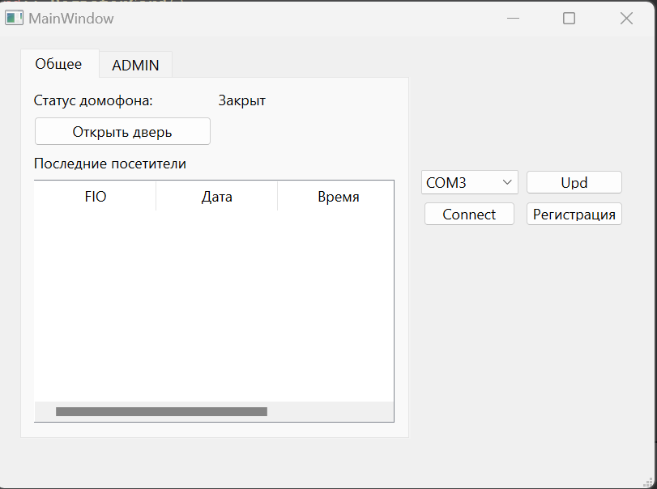
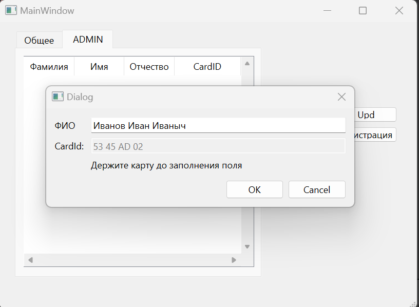
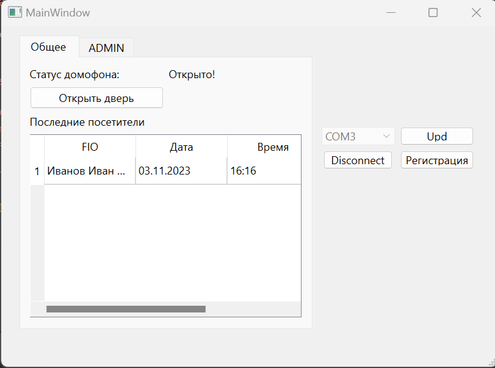
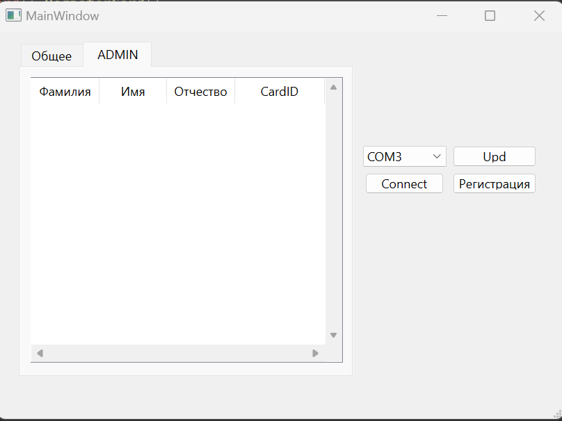

# IntercomArduino
 ## **Example work**


___
*Connect COM Port*
```C++
void MainWindow::importPorts()
{
    qDebug()<<"-------------"
            <<"\n-importPorts";

    const auto serialPortInfos = QSerialPortInfo::availablePorts();
    for (const QSerialPortInfo &portInfo : serialPortInfos)
    {
        qDebug()<< "Port:" << portInfo.portName() << "\n";
        ui->cbComPorts->addItem(portInfo.portName());

    }

    if(ui->cbComPorts->currentText().isEmpty())
        qWarning()<<"\n-----COM PORT IS EMPTY!----\n";


    qDebug()<<"\n-importPorts - Complete"
            << "\n-------------\n\n\n";

}
```
___
## **Register**


*Read CardID*
```C++
void RegisterCard::slotGetCardID()
{
    qDebug()<<"\n\n-slotGetCardID";
    QByteArray data = serialPort.readAll();
    QString line = QString::fromStdString(data.toStdString());
    line = line.remove(rex);

    if (!line.isEmpty())
    {
        qDebug()<<"Line "<<line;
        if(line.startsWith("CardID: ")){
            int i = line.indexOf(" ");//Разделитель строки на подстроки
            if (i > 0)
            {
                QString paramString = line.mid(i + 1, line.length());
                ui->editCardID->setText(paramString);
                if(!ui->editCardID->text().isEmpty())
                {
                    ui->editCardID->setEnabled(false);
                    qDebug()<<"\n-Text in editLine: "<<ui->editCardID->text();
                }
                else
                {
                    ui->editCardID->setEnabled(true);
                    qDebug()<<"\n-None text in EditLine ";
                }
                return;
            }
        }

    }
}
```
___
*RegisterCard::acceptDialog*
```C++
void RegisterCard::acceptDialog()
{
    qDebug()<<"\n\n-acceptDialog";
    if(ui->editName->text().isEmpty())
    {
        QMessageBox::warning(this, 
        "FIO is empty", 
        "Fill in the Surname First Name and Patronymic!",
        QMessageBox::Ok);
        return;
    }
    else
    {
        QStringList FIO = ui->editName->text().split(" ");
        user = new User(FIO[0],FIO[1],FIO[2], ui->editCardID->text());

        serialPort.close();
        RegisterCard::accept();
    }
}
```
___
*RegisterCard::rejectDialog*
```C++
void RegisterCard::rejectDialog()
{
    qDebug()<<"\n\n-rejectDialog";
    serialPort.close();
    RegisterCard::reject();
}
```
___
## Result


